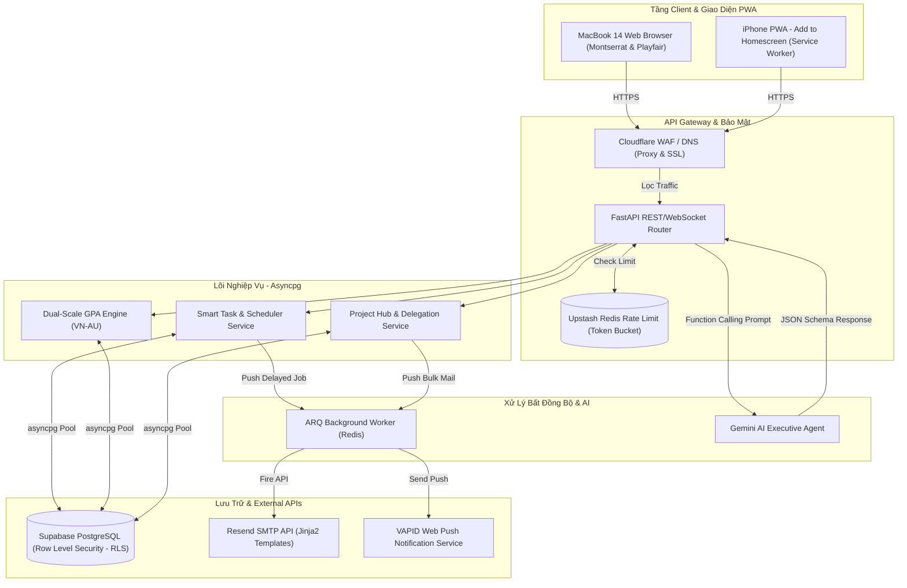
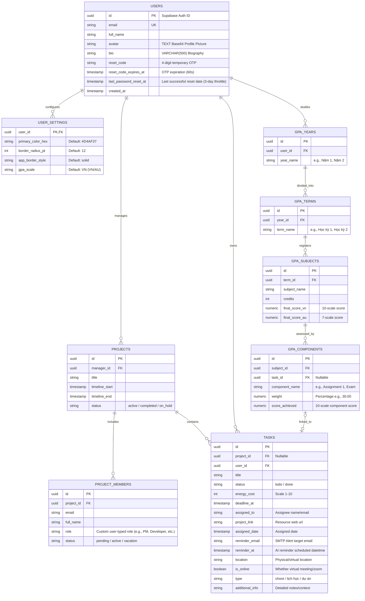
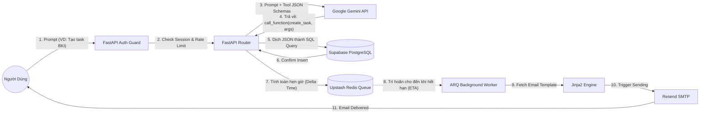
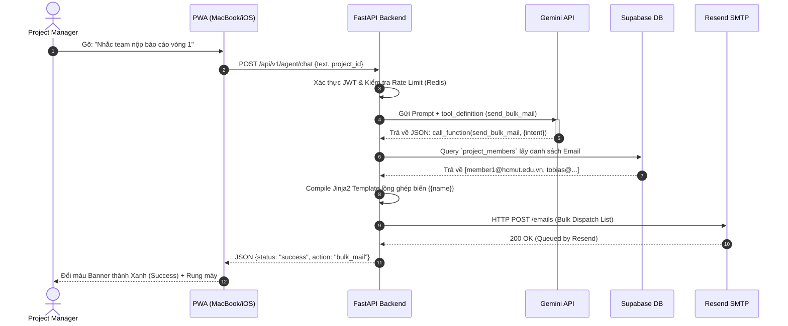
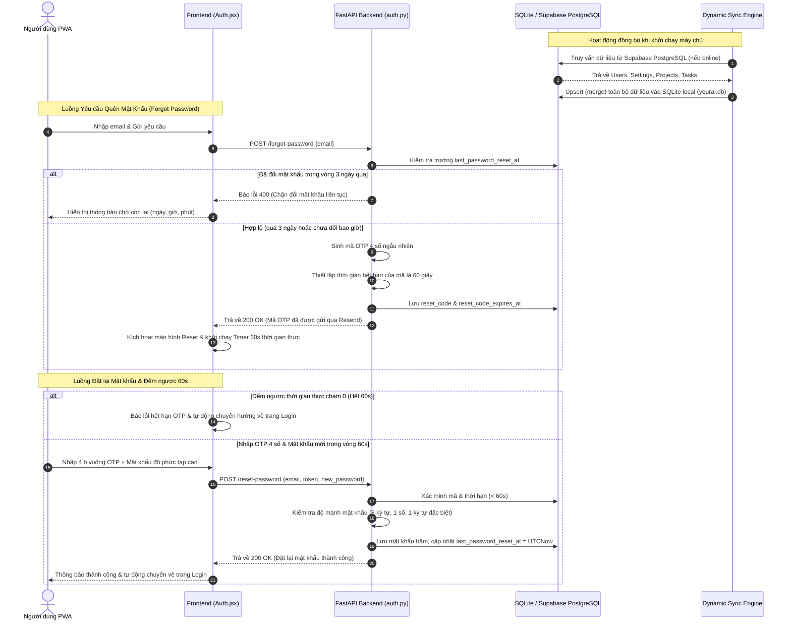
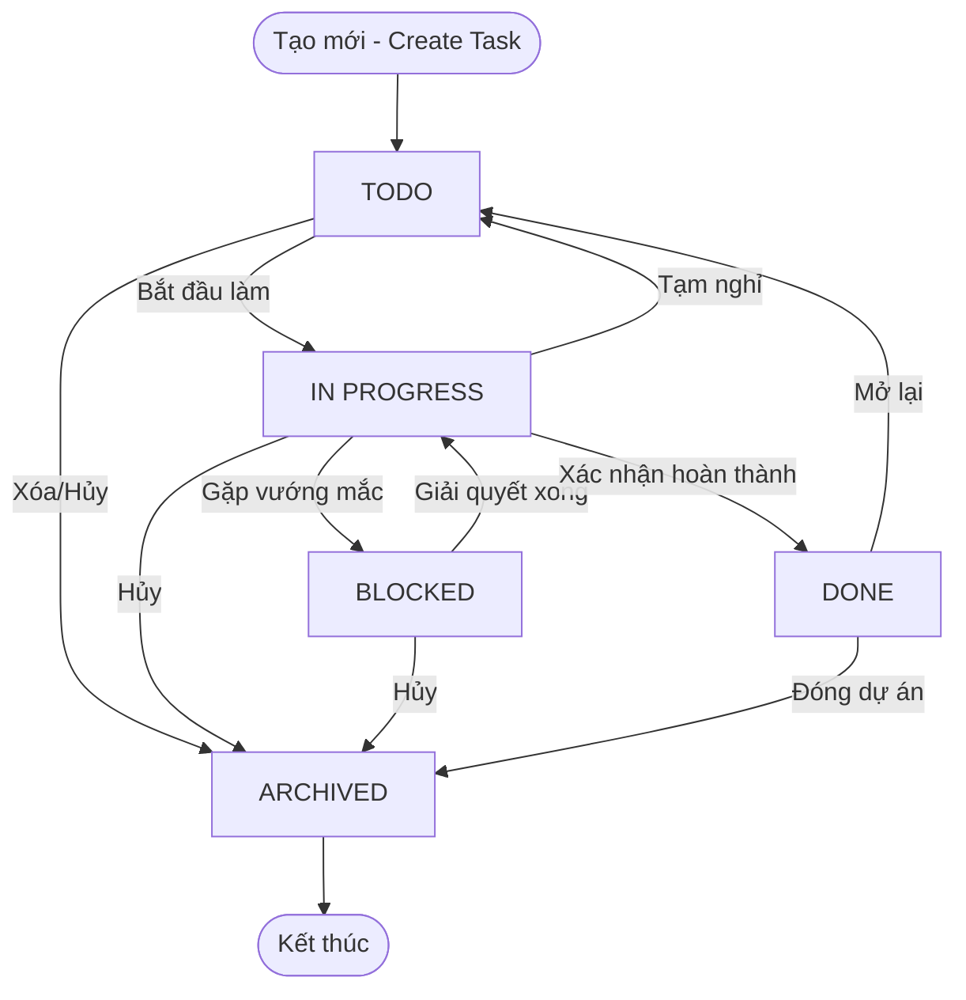
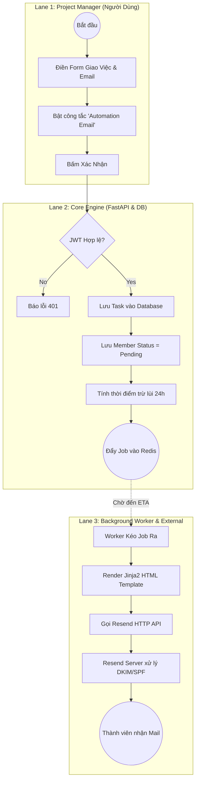
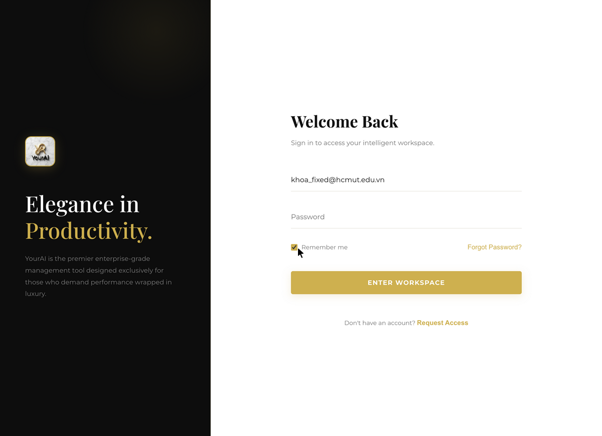

# YourAI v4.0 (Enterprise Edition) - Monorepo AI Assistant

[](https://github.com/yourdomain/yourai)
[](https://github.com/yourdomain/yourai)
[](https://github.com/yourdomain/yourai)

**YourAI v4.0** là giải pháp điều hành công việc, quản trị dự án thông minh tích hợp AI Agent và Lõi tính toán điểm GPA song hệ (Việt Nam - Úc) chuẩn chỉnh sản phẩm dành cho doanh nghiệp lớn (Production-ready). 

Dự án được triển khai dưới dạng **Monorepo** với thiết kế giao diện theo chuẩn **PWA (Progressive Web App)** sang trọng bậc nhất (**Luxury Design System**), mang lại trải nghiệm mượt mà từ MacBook màn hình lớn xuống màn hình di động iPhone (Add to Homescreen) không qua trung gian.

---

## 📖 Sơ Đồ Kiến Trúc Hệ Thống (System Topology & UML)

### 1. Kiến Trúc Phân Tán (System Architecture Topology)


### 2. Sơ Đồ Thực Thể Quan Hệ (Entity Relationship Diagram - ERD)


### 3. Luồng Dữ Liệu Gọi Hàm AI (Data Flow - DFD Level 1)


### 4. Sơ Đồ Tuần Tự Điều Phối Bulk Mail (Sequence Diagram)


### 5. Quy Trình Xác Thực OTP 4 Số & Đồng Bộ Dữ Liệu Tự Động (PWA & Offline Fallback Security Flow)


### 6. Vòng Đời Trạng Thái Công Việc (State Machine)



### 7. Lên Lịch Tự Động & Bắn Mail (BPMN Workflow)


---

## 🛠️ Bộ Tech Stack Tối Ưu Chi Phí Doanh Nghiệp (Zero-Cost Stack)

- **Cloudflare CDN & WAF**: Proxy ẩn IP, chống DDoS, tối ưu Edge caching tài nguyên tĩnh.
- **FastAPI (Lõi Asyncpg + SQLAlchemy)**: High-performance async gateway, tự động sinh tài liệu Swagger OpenAPI chuyên nghiệp.
- **Supabase Auth & PostgreSQL + RLS**: Hệ thống nhận dạng người dùng mạnh mẽ kết hợp cô lập dữ liệu cấp độ DB lõi (Row Level Security).
- **Upstash Redis (Rate Limiter & ARQ)**: Giới hạn tần suất và quản lý hàng đợi công việc bất đồng bộ (3-strike exponential backoff retry).
- **Service Worker PWA & Web Push (VAPID)**: Kích hoạt ứng dụng ngoại tuyến (Offline) và gửi thông báo trực tiếp trên iOS/macOS không cần SDK nặng nề.
- **Google Gemini API**: Trí tuệ nhân tạo nhận dạng hàm (Function Calling) và trích xuất cấu trúc dữ liệu tiếng Việt.

---

## 📂 Cấu Trúc Dự Án (Enterprise Monorepo Directory)

```text
├── backend-engine/                 # Lõi FastAPI + ARQ Worker
│   ├── app/
│   │   ├── api/                    # Tầng REST API Routers
│   │   │   ├── dependencies/       # get_db(), get_current_user()
│   │   │   └── v1/                 # Các routers chức năng v1
│   │   ├── core/                   # Cấu hình hệ thống, rate limiter
│   │   ├── db/                     # asyncpg engine, ORM models
│   │   ├── schemas/                # Validate Pydantic Schemas
│   │   ├── services/               # Lõi GPA math, Gemini AI, Resend SMTP
│   │   └── worker/                 # ARQ background workers & jobs
│   ├── templates/                  # Thư mục chứa mẫu email sang trọng
│   ├── requirements.txt            # Quản lý thư viện Python
│   └── main.py                     # Khởi chạy ứng dụng
│
├── frontend-pwa/                   # PWA React App
│   ├── public/                     # manifest.json, service-worker.js, logo.png
│   ├── src/                        # Core network, App.jsx, index.css
│   └── vite.config.js              # Cấu hình Vite bundler
```

---

## 🚀 Hướng Dẫn Chạy Cài Đặt & Vận Hành (Quickstart)

### 1. Khởi Chạy Backend (FastAPI Engine)
Di chuyển vào thư mục backend và cài đặt thư viện cần thiết:
```bash
cd backend-engine
pip install -r requirements.txt
```

Cấu hình các API Key và kết nối cơ sở dữ liệu trong file `.env` (Mặc định đã được thiết lập chạy SQLite local cực nhanh để kiểm thử):
```bash
# Chạy server Uvicorn local
python main.py
```
*Tru cập Swagger API docs tại:* `http://localhost:8000/docs`

### 2. Khởi Chạy Frontend (PWA App)
Di chuyển vào thư mục frontend và cài đặt dependencies:
```bash
cd frontend-pwa
npm install
npm run dev
```
*Truy cập bảng điều khiển giao diện tại:* `http://localhost:5173`

---

## 🎨 Hệ Thống Thiết Kế Luxury UI/UX Design System
- **Accents Vàng Kim**: `#D4AF37` (Classic Gold) đem lại vẻ lịch lãm và quý phái.
- **Nghệ Thuật Chữ**: Sự kết hợp giữa `Playfair Display` cổ điển quyền lực và `Montserrat` tối giản hiện đại.
- **Surface**: Alabaster White (`#FAF9F6`) dịu mắt phối hợp hiệu ứng mờ nhòe kính cường lực (**Glassmorphism**) đem lại chiều sâu vô song cho giao diện.

---

## 🔒 Cô Lập Dữ Liệu Đa Tài Khoản & Khởi Tạo Trạng Thái Về 0 (Zero-State Workspace)

Để đáp ứng tiêu chuẩn kiến trúc Enterprise-grade, hệ thống đảm bảo cô lập dữ liệu 100% giữa các người dùng:
1. **Database Level Isolation**: Tất cả các truy vấn thông tin công việc (`TASKS`), dự án (`PROJECTS`), cấu hình giao diện (`USER_SETTINGS`), và học tập (`GPA_YEARS`, `GPA_TERMS`, `GPA_SUBJECTS`, `GPA_COMPONENTS`) trên backend đều được lọc nghiêm ngặt qua khóa ngoại `user_id == current_user.id`. Đảm bảo người dùng này tuyệt đối không thể xem hay sửa đổi dữ liệu của người dùng khác.
2. **Zero-State Workspace**: Trạng thái mặc định ban đầu của Dashboard khi người dùng mới đăng ký hoàn toàn trống rỗng (`0 tasks`, `0 projects`, `0 subjects`). Giúp người dùng có toàn quyền thiết lập và cá nhân hóa lộ trình của riêng mình mà không bị chồng lấn hay ảnh hưởng bởi các giá trị mock cũ.

---

## 📸 Minh Chứng Thực Nghiệm & Visual Test Suite

Dưới đây là hình ảnh thực tế ghi lại từ Suite Kiểm thử Trình duyệt Tự động (Browser Subagent) về giao diện đăng nhập split-screen thương lưu và thông báo trạng thái:

### 1. Giao Diện Đăng Nhập Luxury Split-Screen Welcome Page
Sử dụng thiết kế chia đôi màn hình tối giản thanh lịch: Cột trái Obsidian-Dark mang biểu trưng logo thương hiệu YourAI ở tâm dọc và châm ngôn *"Elegance in Productivity"* vàng gold; Cột phải Pure-White với ô nhập liệu dạng kẻ chân thanh mảnh, tính năng **Remember me** tự động lưu trữ thông tin đăng nhập bảo mật trong localStorage, và nút bấm *"ENTER WORKSPACE"* sang trọng:



### 2. Thông Báo Đăng Xuất Thành Công (Secure Logout Redirect)
Khi người dùng bấm nút "Đăng xuất" ở góc trái sidebar, phiên làm việc sẽ bị chấm dứt ngay lập tức trên cookies bảo mật, đưa người dùng trở lại màn hình đăng nhập kèm thông báo Toast Gold-Black *"Đăng xuất thành công!"*:


